This document presents Google's COVID-19 Global Mobility Data for places like local parks, national parks, public beaches, marinas, dog parks, plazas, and public gardens, furthr referred to as parks in countries of the Africa, Caribbean and Pacific group of states.

Data are downloaded from <https://www.google.com/covid19/mobility/>

## Caribbean

### Antigua & Barbuda

<!-- -->

<!-- -->

\FloatBarrier

### Bahamas

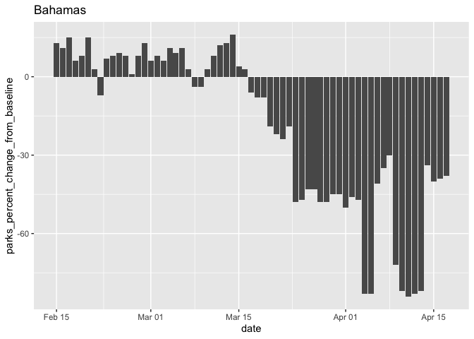<!-- -->

<!-- -->

\FloatBarrier

### Belize

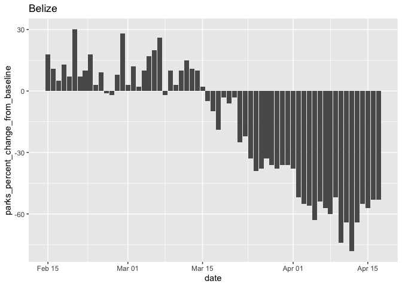<!-- -->

<!-- -->

\FloatBarrier

### Barbados

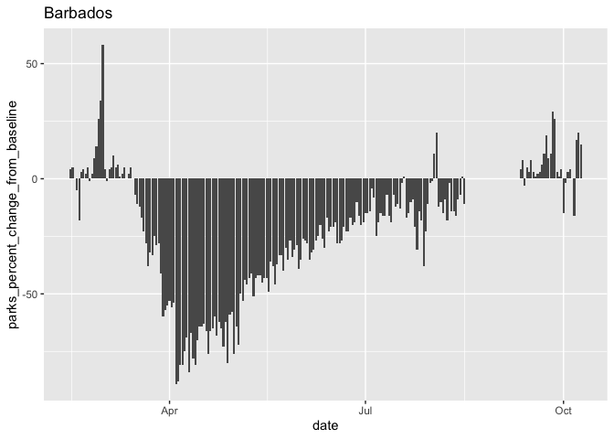<!-- -->

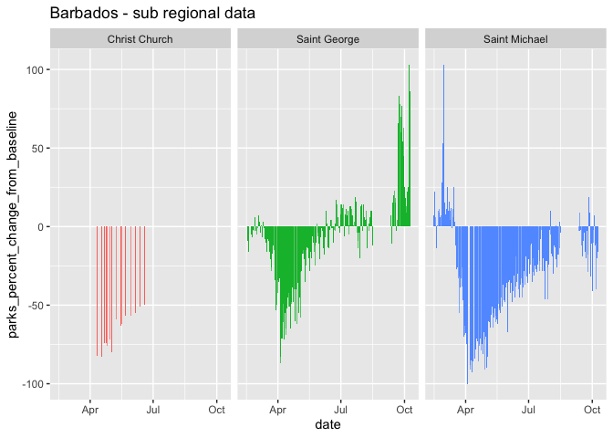<!-- -->

\FloatBarrier

### Cuba

No mobility data in parks for Cuba

\FloatBarrier

### Dominica

No mobility data in parks for Dominica

\FloatBarrier

### Dominican Republic

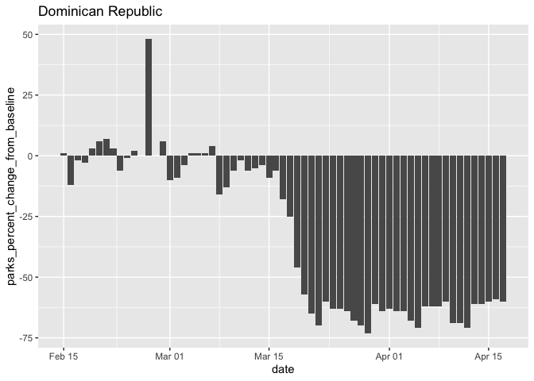<!-- -->

<!-- -->

\FloatBarrier

### Grenada

No mobility data in parks for Grenada

\FloatBarrier

### Guyana

No mobility data in parks for Guyana

\FloatBarrier

### Haiti

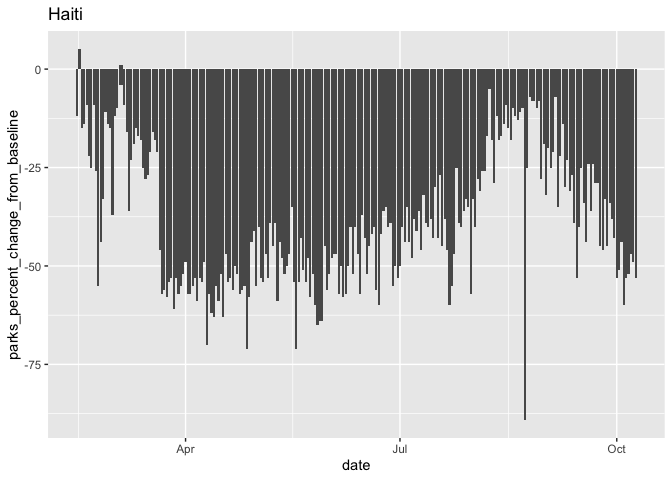<!-- -->

<!-- -->

\FloatBarrier

### Jamaica

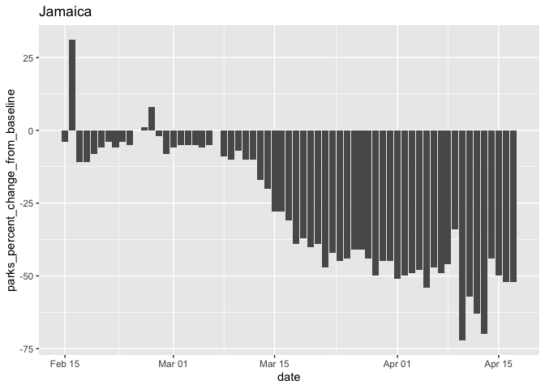<!-- -->

<!-- -->

\FloatBarrier

### St. Kitts & Nevis

No mobility data in parks for St. Kitts & Nevis

\FloatBarrier

### St. Lucia

No mobility data in parks for St. Lucia

\FloatBarrier

### Suriname

No mobility data in parks for Suriname

\FloatBarrier

### Trinidad & Tobago

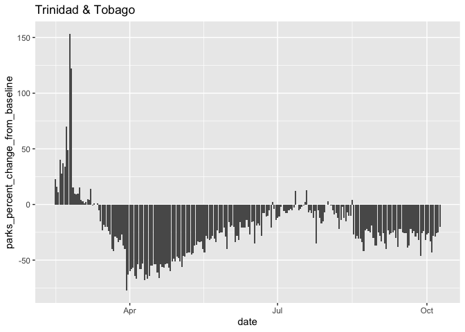<!-- -->

\FloatBarrier

### St. Vincent & Grenadines

No mobility data in parks for St. Vincent & Grenadines

\FloatBarrier

## Central Africa

### Burundi

No mobility data in parks for Burundi

\FloatBarrier

### Central African Republic

No mobility data in parks for Central African Republic

\FloatBarrier

### Cameroon

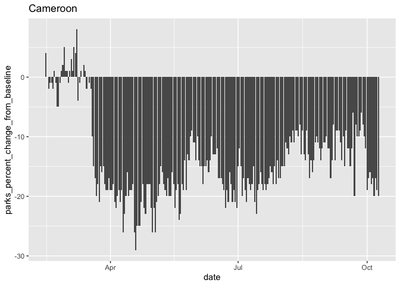<!-- -->

<!-- -->

\FloatBarrier

### Congo - Kinshasa

No mobility data in parks for Congo - Kinshasa

\FloatBarrier

### Congo - Brazzaville

No mobility data in parks for Congo - Brazzaville

\FloatBarrier

### Gabon

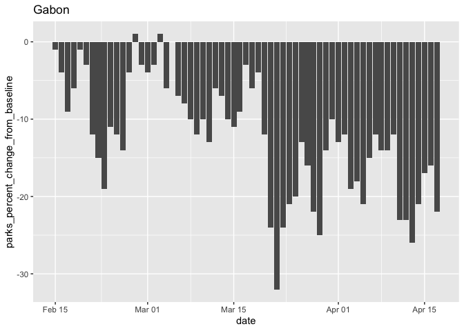<!-- -->

<!-- -->

\FloatBarrier

### Equatorial Guinea

No mobility data in parks for Equatorial Guinea

\FloatBarrier

### São Tomé & Príncipe

No mobility data in parks for São Tomé & Príncipe

\FloatBarrier

### Chad

No mobility data in parks for Chad

\FloatBarrier

## Eastern Africa

### Djibouti

No mobility data in parks for Djibouti

\FloatBarrier

### Eritrea

No mobility data in parks for Eritrea

\FloatBarrier

### Ethiopia

No mobility data in parks for Ethiopia

\FloatBarrier

### Kenya

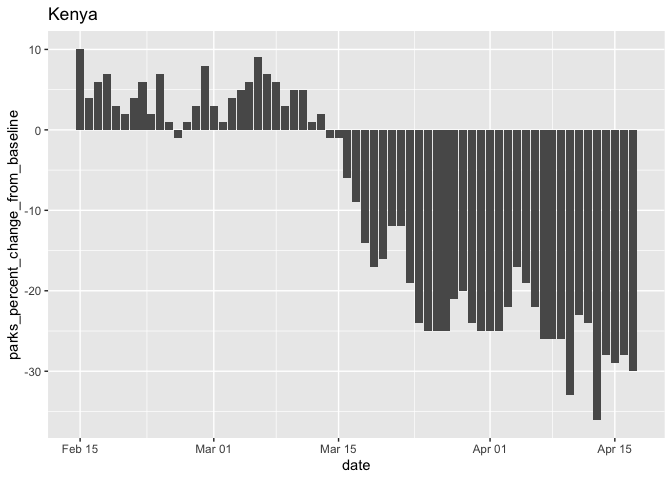<!-- -->

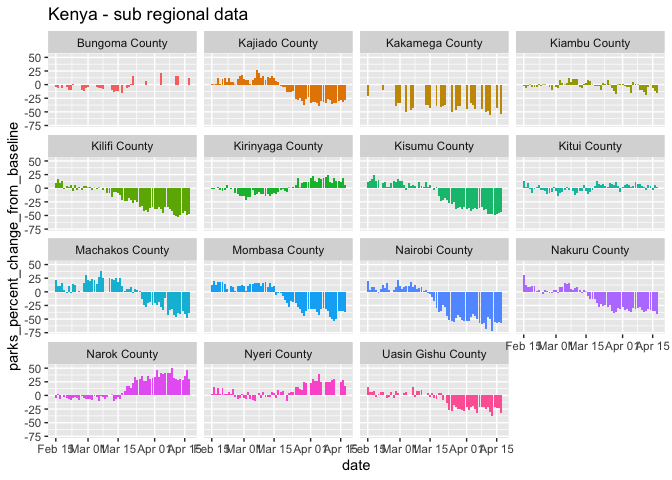<!-- -->

\FloatBarrier

### Rwanda

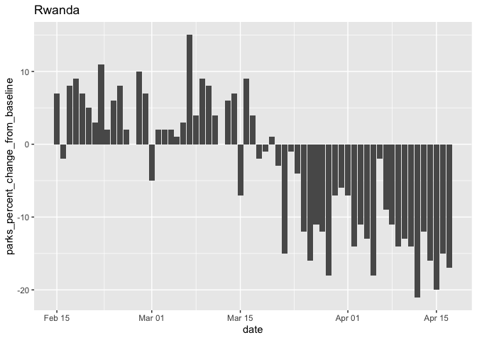<!-- -->

<!-- -->

\FloatBarrier

### Sudan

No mobility data in parks for Sudan

\FloatBarrier

### Somalia

No mobility data in parks for Somalia

\FloatBarrier

### South Sudan

No mobility data in parks for South Sudan

\FloatBarrier

### Tanzania

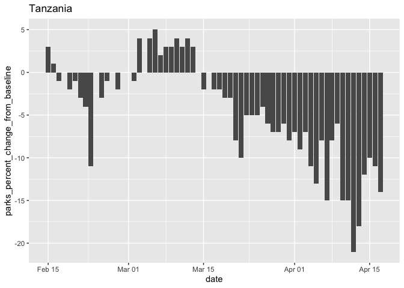<!-- -->

<!-- -->

\FloatBarrier

### Uganda

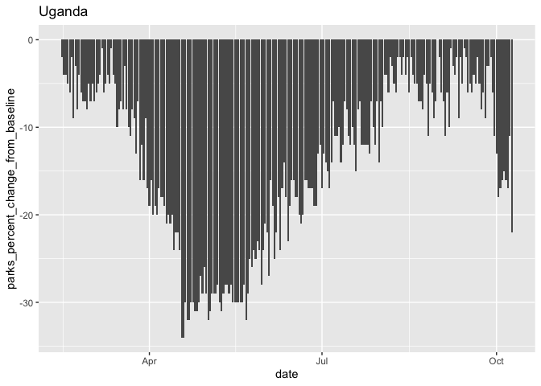<!-- -->

<!-- -->

\FloatBarrier

## Pacific

### Cook Islands

No mobility data in parks for Cook Islands

\FloatBarrier

### Fiji

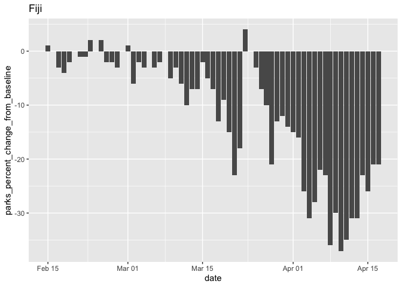<!-- -->

\FloatBarrier

### Micronesia (Federated States of)

No mobility data in parks for Micronesia (Federated States of)

\FloatBarrier

### Kiribati

No mobility data in parks for Kiribati

\FloatBarrier

### Marshall Islands

No mobility data in parks for Marshall Islands

\FloatBarrier

### Niue

No mobility data in parks for Niue

\FloatBarrier

### Nauru

No mobility data in parks for Nauru

\FloatBarrier

### Palau

No mobility data in parks for Palau

\FloatBarrier

### Papua New Guinea

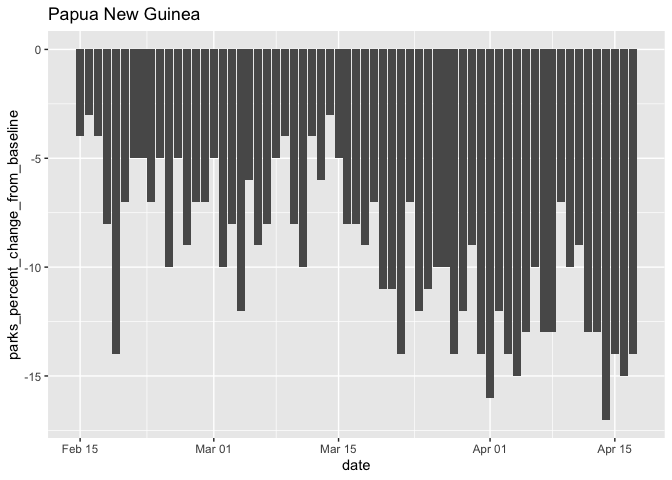<!-- -->

\FloatBarrier

### Solomon Islands

No mobility data in parks for Solomon Islands

\FloatBarrier

### Timor-Leste

No mobility data in parks for Timor-Leste

\FloatBarrier

### Tonga

No mobility data in parks for Tonga

\FloatBarrier

### Tuvalu

No mobility data in parks for Tuvalu

\FloatBarrier

### Vanuatu

No mobility data in parks for Vanuatu

\FloatBarrier

### Samoa

No mobility data in parks for Samoa

\FloatBarrier

## Southern Africa

### Angola

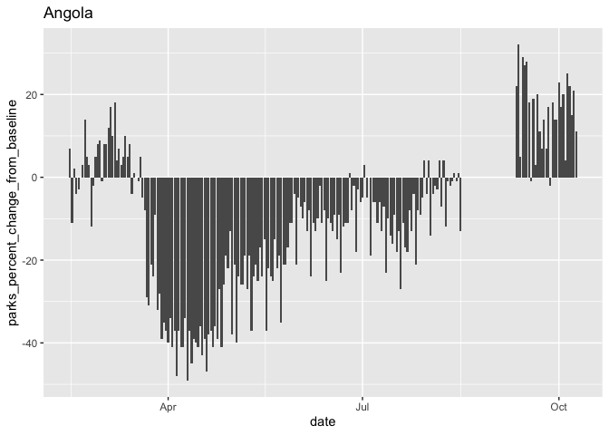<!-- -->

<!-- -->

\FloatBarrier

### Botswana

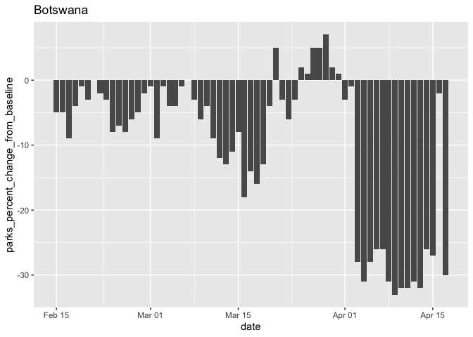<!-- -->

<!-- -->

\FloatBarrier

### Comoros

No mobility data in parks for Comoros

\FloatBarrier

### Lesotho

No mobility data in parks for Lesotho

\FloatBarrier

### Madagascar

No mobility data in parks for Madagascar

\FloatBarrier

### Mozambique

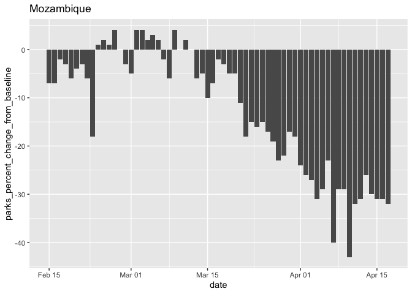<!-- -->

<!-- -->

\FloatBarrier

### Mauritius

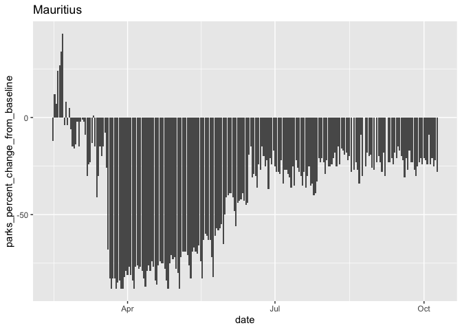<!-- -->

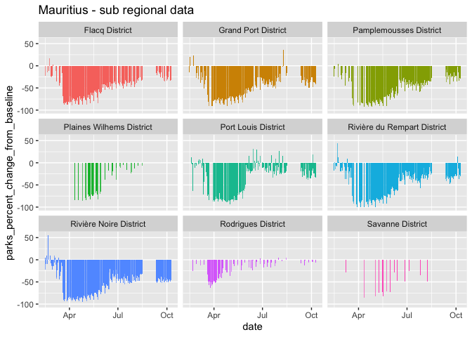<!-- -->

\FloatBarrier

### Malawi

No mobility data in parks for Malawi

\FloatBarrier

### Namibia

No mobility data in parks for Namibia

\FloatBarrier

### Swaziland

No mobility data in parks for Swaziland

\FloatBarrier

### Seychelles

No mobility data in parks for Seychelles

\FloatBarrier

### South Africa

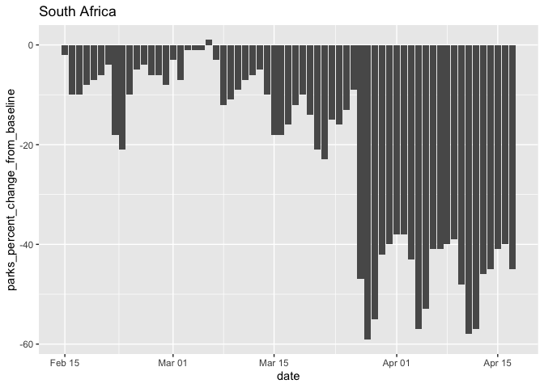<!-- -->

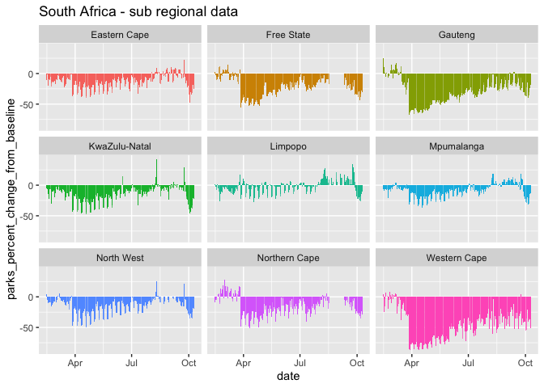<!-- -->

\FloatBarrier

### Zambia

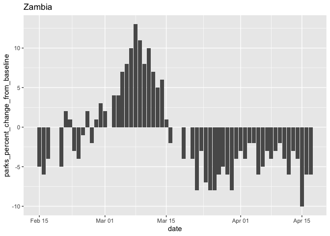<!-- -->

\FloatBarrier

### Zimbabwe

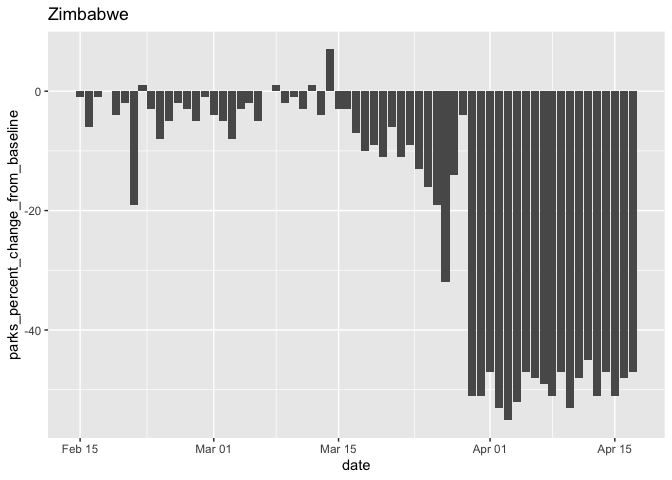<!-- -->

<!-- -->

\FloatBarrier

## Western Africa

### Benin

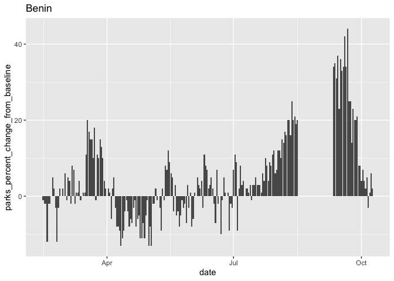<!-- -->

<!-- -->

\FloatBarrier

### Burkina Faso

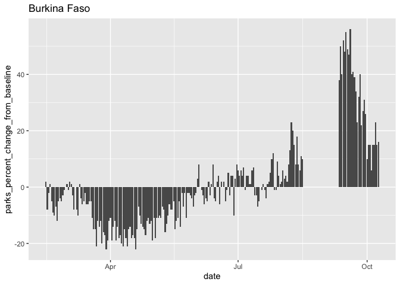<!-- -->

<!-- -->

\FloatBarrier

### Côte d’Ivoire

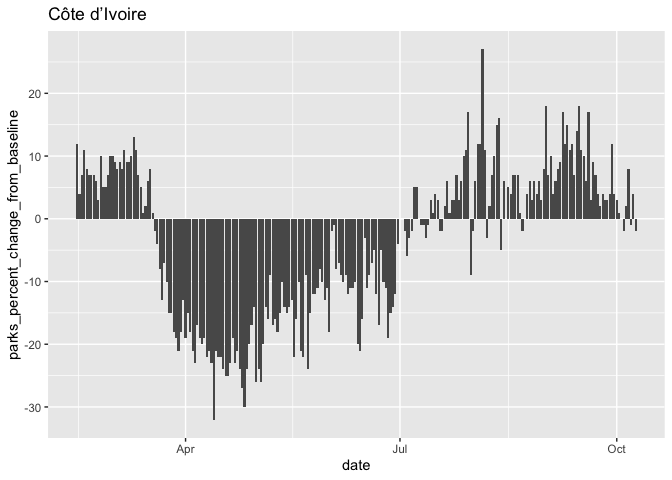<!-- -->

<!-- -->

\FloatBarrier

### Cape Verde

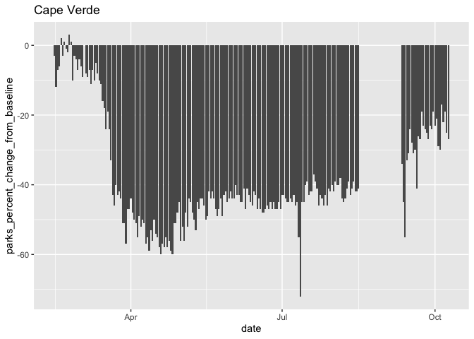<!-- -->

<!-- -->

\FloatBarrier

### Ghana

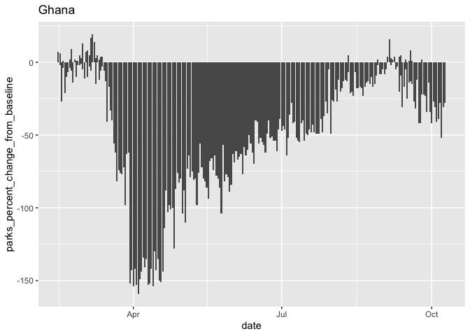<!-- -->

\FloatBarrier

### Guinea

No mobility data in parks for Guinea

\FloatBarrier

### Gambia

No mobility data in parks for Gambia

\FloatBarrier

### Guinea-Bissau

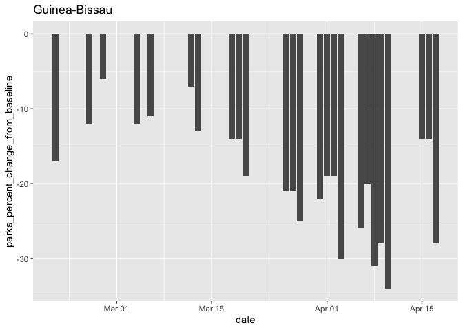<!-- -->

\FloatBarrier

### Liberia

No mobility data in parks for Liberia

\FloatBarrier

### Mali

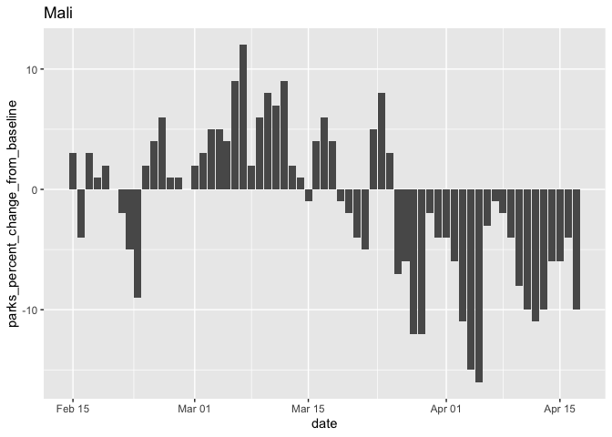<!-- -->

\FloatBarrier

### Mauritania

No mobility data in parks for Mauritania

\FloatBarrier

### Niger

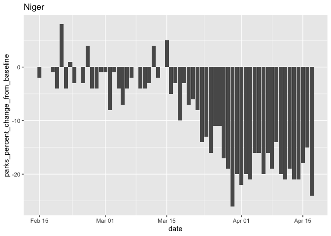<!-- -->

<!-- -->

\FloatBarrier

### Nigeria

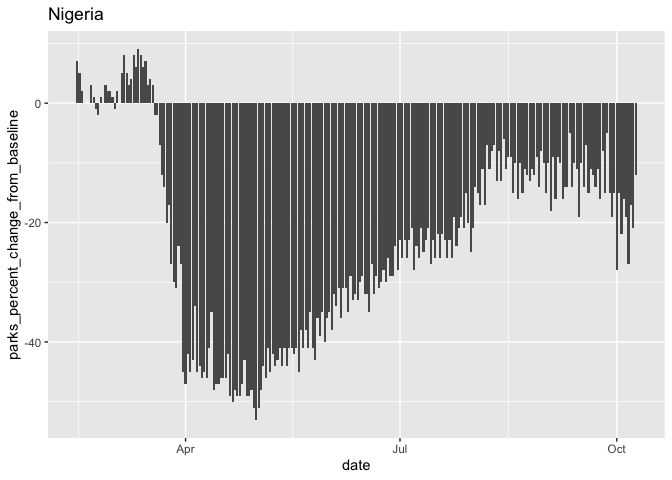<!-- -->

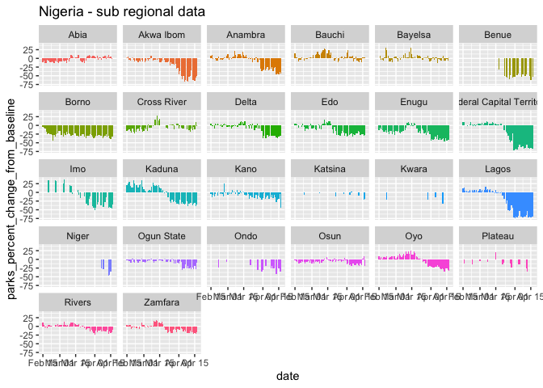<!-- -->

\FloatBarrier

### Senegal

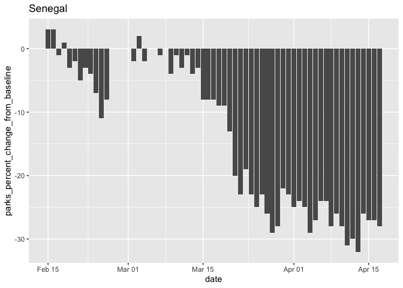<!-- -->

<!-- -->

\FloatBarrier

### Sierra Leone

No mobility data in parks for Sierra Leone

\FloatBarrier

### Togo

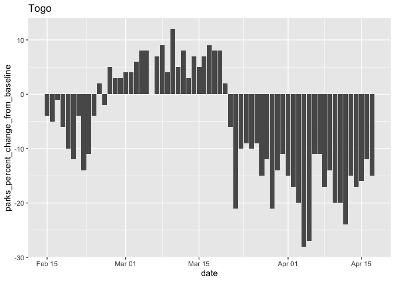<!-- -->

<!-- -->

\FloatBarrier
